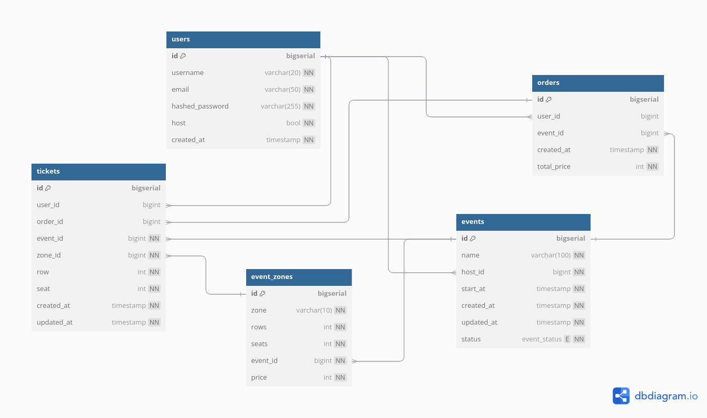

# 售票模擬系統

專案目的： 練習 golang 與分佈式系統中常見工具的整合及軟體架構設計的能力

### TODO List

- [x] Backend API for User, Events, Orders and User authentication with JWT
- [x] Buying Ticket Logic and claim ticket with expiration using Redis and lua script
- [x] RabbitMQ consumer with Ticket Creation (Insert available tickets to table)
- [x] RabbitMQ Dead Letter Exchange for failed message
- [x] Ticket Buying Massive request Simulation script (Client)
- [ ] Setting up kubernetes for backend cluster and load balancing
- [ ] CDC pipeline to notify user in queue for available ticket

### User Case

- 建立活動 -> 劃分座位區域及數量 -> 建立對應門票
- 選擇活動 -> 選擇座位區域及數量 -> 保留門票 -> 建立訂單或是超時釋放門票

### How to Start

Create Required Container
```
cd backend
make postgres
make redis
make mq
```

Setting up DB
```
cd backend
make createdb
make migrateup
make sqlc
```

Build and Run
```
// Backend
cd backend
make server

// Consumer
cd consumer
make build
make server

// Client
cd client
make build
make client // or execute it manually ./client -attempt 1000
```

### System Design & Database Schema




### 使用 Redis 完成購票流程

1. 先從 DB 中找到滿足使用者要求的活動(Event), 座位區域(Zone), 第幾排(Row) 的門票
2. 從中篩選出還沒有 user_id 的門票
3. 將這些 ticket_id 丟進 redis 中檢查是否目前有人搶到票了但還沒結帳
    - 需要配合 lua script 來達成原子性, 因為過程中需要檢查多張票
    - script 中若發現 ticket_id 沒有值, 則馬上將其設為 request 的 user_id
    - script 最後可能遇到不滿足使用者的票數, 需要將剛剛獲得得票從 redis 中刪除
4. 最後帶著已暫時獲取的 ticket_id 丟入 order API 來結帳
    - 會從檢查 redis 中檢查 ticket_id 是否屬於 user

- 暫時獲取的門票在 redis 中設置了 5min expire time
- 使用 lua script 避免在多個 user 從 DB 拿到一樣的門票後直接存取

```lua
local ticket_ids = ARGV
local quantity = tonumber(KEYS[1])
local userID = tonumber(KEYS[2])

local claimed_tickets = {}
local count = 0

for i, ticket_id in ipairs(ticket_ids) do
    local key = "ticket:" .. ticket_id

    local result = redis.call("SETNX", key, userID)
    if result == 1 then
        redis.call("EXPIRE", key, 300)

        table.insert(claimed_tickets, ticket_id)
        count = count + 1

        if count == quantity then
            break
        end
    end
end

if count < quantity then
    for _, ticket_id in ipairs(claimed_tickets) do
        local key = "ticket:" .. ticket_id
        redis.call("DEL", key)
    end
    return {}
end

return claimed_tickets
```

### 使用 RabbitMQ 完成活動建立流程

這個專案中, 當活動建立後, 我採取了事先將全部 Ticket 建立完成的方式

1. 使用者發出 Create Event 的 Request 後確認格式沒問題會馬上 response
2. Backend Service 會將建立大量 Ticket 的動作透過 rabbitMQ 交給 consumer service 做
    - 避免 User 需要長時間等待 Response
3. Consumer 收到後再去和 Database 建立票倉

在 consume message 的時候, 可能會有無法處理 message 的情況導致沒有正確建立票倉, 最後導致活動沒有票
這邊採取 dead letter exchange 的方式來將失敗的 message 送回去重做

Why not requeue ?
- 使用一般 requeue 的方式會讓 message 回到 queue 的前面
- 建立票倉的情境不在乎順序, 只要讓全部 message 被完成即可
- 若該 message 一定會失敗, 或是因為 consumer 繁忙導致的錯誤, 馬上回到 queue 中不會解決問題

Dead letter exchange 作法
- 動態新增一個 Wait Queue, 並將失敗的 message 往裡面丟
- 失敗的 Message 中多紀錄一個 retry 次數的 header, 要是超過上限則直接捨棄
- Wait Queue 沒有人消化, 所有裡面的 message 都可以因為 x-message-ttl 的過期時間觸發 DLE
- 透過設定將 Wait Queue 透過 DLE 轉送到原本的 Ticket Work Queue 中

上述作法讓其他 message 有機會被消化, 失敗的 message 重新排隊
同時在特定情況下也可以讓 consumer 不要這麼繁忙

還有更好的作法是在動態新增 queue 時, 根據 retry 次數設置某個時間範圍內的 x-message-ttl
這會讓系統同時有多個 wait queue 來幫忙排隊, 也可以避免一個 queue 一次觸發太多 DLE
